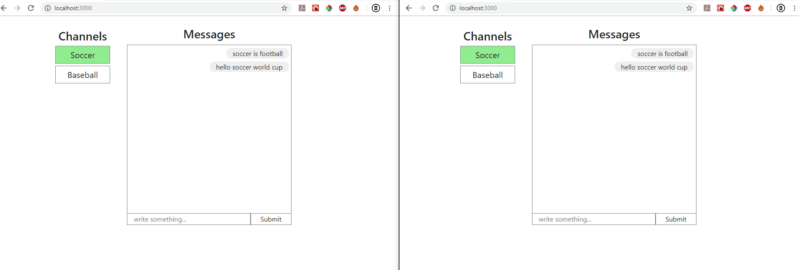

This project was bootstrapped with [Create React App](https://github.com/facebook/create-react-app).

In the project directory, open server in different window of any editor, then write :

### `npm install`
### `npm start`

This will start the server in port 4000.
To see GraphQL View, write [http://localhost:4000/graphiql](http://localhost:4000/graphiql)

After starting server, open main project directory and write (to start Client):

### `npm install`
### `npm start`

click on the gif to see full demo

## Description

Soccer and Baseball are Channels. You can open this app in multiple tabs or multiple browsers. It has notification functionality which will show counts of new Message arrival in channels, when you open that channel, that notification will be removed. If your current channel receiving new messages then counts will not be shown. You can add new Message in respected channel by clicking on "Soccer" or "Baseball", you can do it by "Enter" or "Submit button".
